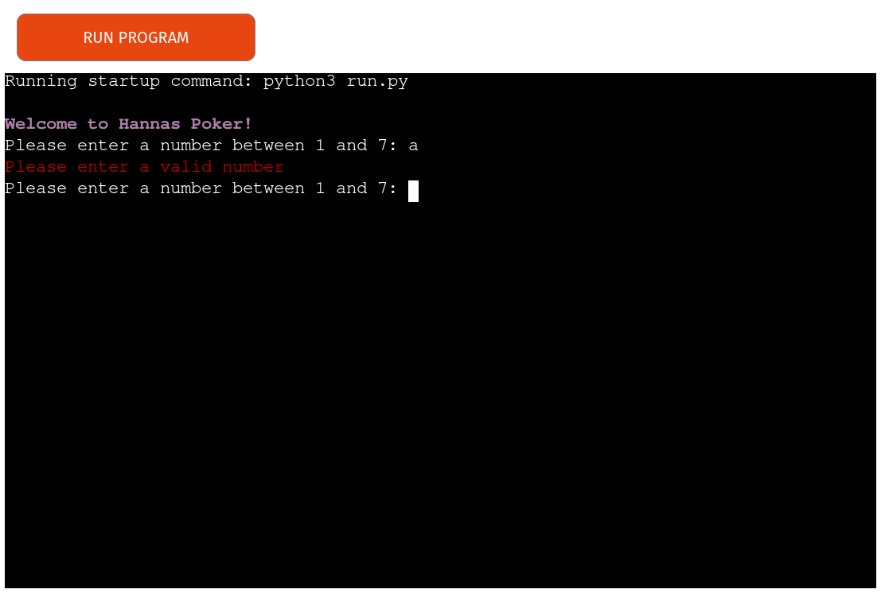
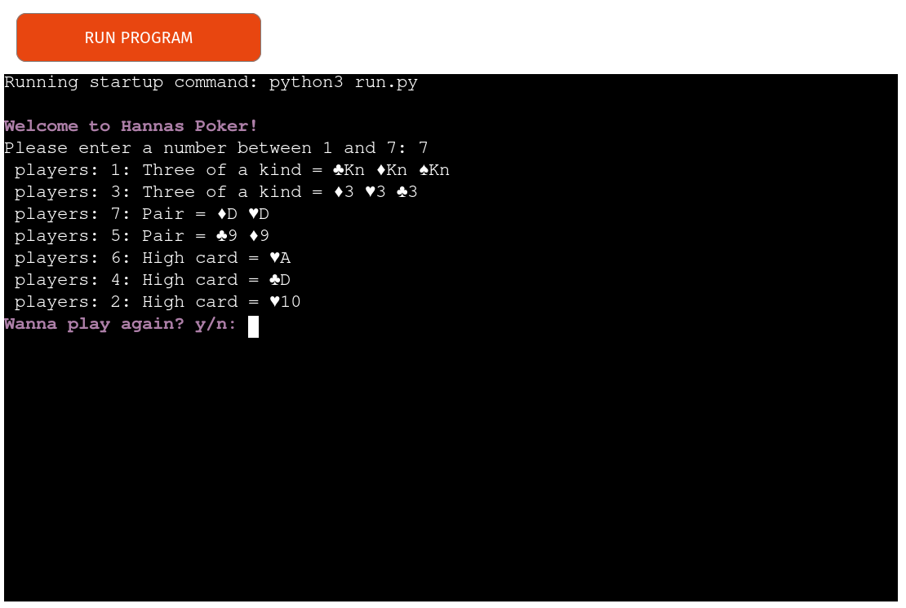
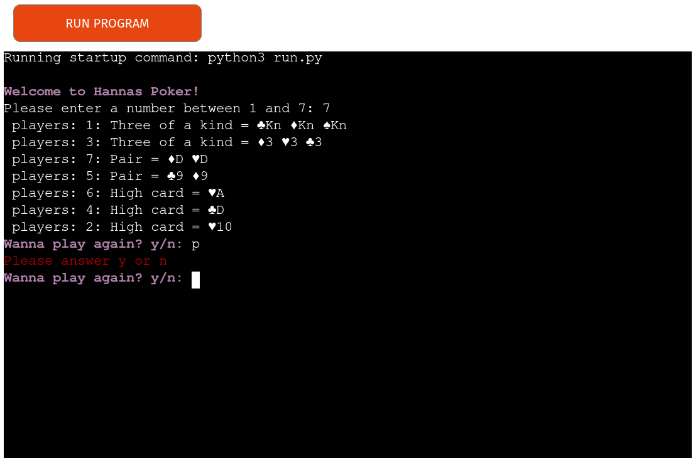
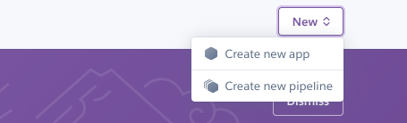

# Hannas Poker Game

So this game is basically a five-card draw without the "draw" part, so the player only gets to play with the initial 5 cards they were dealt.
I made this game as a part of [Code Insitute's](https://codeinstitute.net/se/) fullstack developer course where i had to "build a command-line application that allows your users to manage a common dataset about a particular domain."

[Live link for game](https://hannaspokergame.herokuapp.com/)

---

## CONTENTS

* [User Experience](#user-experience-ux)
  * [User Stories](#user-stories)
    * [Visitor Goals](#visitor-goals)

* [Design](#design)
  * [Design responsivity](#design-responsivity)
  * [General design](#general-design)

* [Features](#features)
  * [General Features on Each Page](#general-features-on-each-page)
  * [Future Implementations](#future-implementations)

* [Technologies And Languages Used](#technologies-and-languages-used)

* [Deployment](#deployment)

* [Testing](#testing)

* [Credits](#credits)
  * [Code Used](#code-used)
  * [Acknowledgments](#acknowledgments)

---

## User Experience (UX)
### User stories
#### Visitor goals
- The main goal is to let the user play a simple pokergame.
- The user should be able to interact with the game.
- The user should not be able to enter in a wrong value.
- The user should receive direct feedback on wheter the value is accepted or not.
- The user should have the possiblity to play again and try to improve.

### Design

#### Design responsivity

Design responsivity to different screen sizes was not part of this project, and it’s therefore outside of the intended scope. 
Although, the player can play the game on different devices such as a phone, laptop, tablet or desktop, the game preforms best on a desktop.

Deployment via Heroku was a requirement of this project, which has its limitations, as well as the fact that this is a pure Python project.

### General design
Within the constraints of the project, I used two main methods to alter the apperance of the game.

The first was that I imported the external library termcolor so that I could change the colour of the text. Magenta is used throughout for questions posed to the user. Red is used when the player has entered a wrong value and the game prompts the player to reenter a valid value. Blue color is for the goodbye message. And white is for the score.

The colour adds a little variety, and makes the game a bit moire interesting than just simple white on black text.

The second design feature I used were the typwriting animation that text out each letter like an old typewriter. These were copied and pasted from [Here](https://stackoverflow.com/questions/19911346/create-a-typewriter-effect-animation-for-strings-in-python). 

## Features

### General features on each page

1. The user is greeted with a welcome message being typed with an animation, then asked how many players wanna join. 

2. When the player types in an option that is a typo or isn't in general a valid respons, an error message comes up explaning the error and the user is asked the question again. Throughout the game, errors are handled in this way and loop back to the question.

3. The player can add upp to 7 players and then the game will present the scores with the winner in the top and the looser in the bottom. It will also present what hand each player had.

4. Then the user gets asked if they wanna play again, and is prompted to use "y" or "n".

5. If the user doesn not enter "y" or "n" either in lower case or uppercase the game will throw an error saying Please answer y or n.

6. If the user chooses y on the play again question the game will ask again how many players?

7. If the player chooses n on the play again question the game will type a "Thanks for playing" message in the same animation as the welcome message.

### Future Implementations

* Add a "draw" possibility for the players to better their hand
* Add a multiple rounds options that logs the score of each player/round and when all rounds are finished show a winner.
* Add a choice to see what the different pokerhands are.

## Technologies And Languages Used

* python - main language 
(imported Python libraries:
random
sys
termcolor - external library, requires pip install
time)

* Node.js

* Heroku - for deployment

* GitHub/ GitPod - version control

## Deployment & Local Development

### Deployment

1. First we head over to [Heroku](https://www.heroku.com) and sign into our account.

2. When you are logged in press "new" and select "create new app".

3. Then you add an appname and choose a region and press "Create app"

4. Head into "settings" and add the buildpacks needed. For this project it was Python and nodejs.

5. Then go back to deployment and choose github as your deployment method. Search for the right repository and connect it.

6. Then you can enable automatic deploys if you want the app to update as soon as you push new code to github or if you manually wanna deploy the branch.

## Testing

I used the CI Pythjon Linter, found at (https://pep8ci.herokuapp.com/#), to check that my Python code was up to the PEP8 standard. I coped and pasted my Python code into the box, a few errors accured such as whitespaces and line to long. But after quick fixes i reentered my code and my code passed with an all clear.

| No | Bug/Issue | How I solved the issue |
| :--- | :--- | :--- |
| 1 | The game broke when entering a letter instead of a number in the "How Many players" question. | I changed the While loop so i could add in try and except. |
| 2 | When trying to connect my run.py to my classes the game kept breaking | After a lot of research into classes i realised the mistake was simply a typoo. |
| 3 | After initial testing by friends and family, the respond was that the purple text was not visable enough | Simply added the bold attribute to termcolor to make the text pop more against the black background. |

## Credits

### Code Used

For the text animation i have on my welcome text and my exiting text i used the code i found [Here](https://stackoverflow.com/questions/19911346/create-a-typewriter-effect-animation-for-strings-in-python). 
  
###  Acknowledgments

- Martina Terlevic: My amazing Code Institute Mentor whos always there when i need her!
- The Code Institute Slack channel Peer Code Review - Thank you to everyone who took the time to play the quiz and look over the code.

